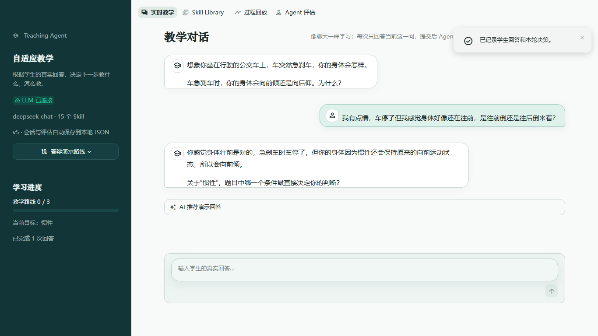
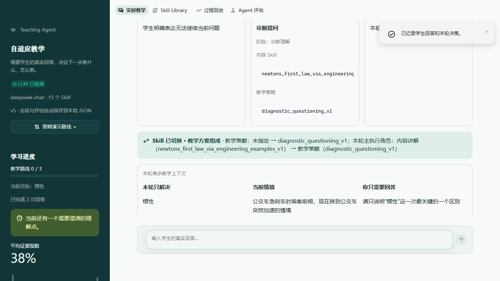
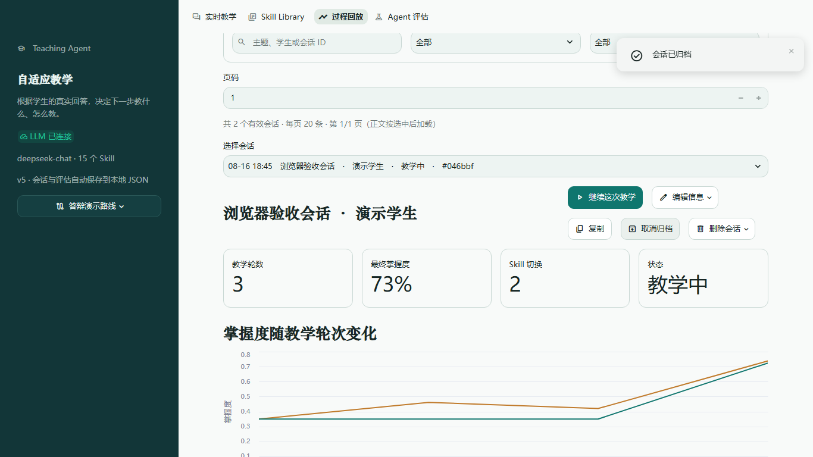
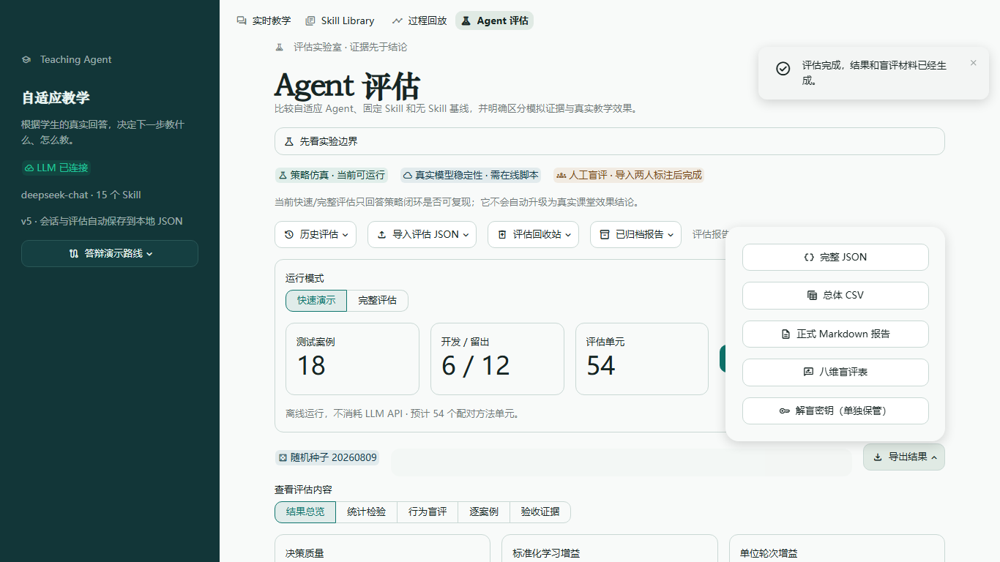

# 自适应教学 Agent 项目报告

**华东师范大学夏令营硕士生综合考察题（二）**

项目仓库：[https://github.com/jtq666/adaptive-teaching-agent](https://github.com/jtq666/adaptive-teaching-agent)

## 一、项目简介

本项目实现了一个面向实时教学的自适应教师 Agent。它不直接生成一大段标准答案，而是根据学生当前回答判断“学生卡在哪里”，选择合适的教学策略，只推进一个教学步骤，并等待学生继续回答。

项目要解决的核心问题是：让 Agent 能够根据学生状态动态调整教学方式，而不是对所有学生使用同一套固定问答。

## 二、系统工作流程

```text
学生回答
   ↓
识别掌握状态与困惑
   ↓
选择内容 Skill / 教学策略
   ↓
生成一条针对当前问题的反馈和一个问题
   ↓
记录状态、证据与教学决策，进入下一轮
```

系统重点遵循三条原则：

1. 一轮只推进一个教学步骤，避免一次讲太多内容。
2. 学生困惑时先诊断和澄清，不直接跳到完整答案。
3. 学生基本掌握后，用新情境进行迁移验证，而不是只判断原题是否答对。

## 三、系统演示

演示主题为“公交车急刹车与惯性”。截图来自真实浏览器验收，使用 Streamlit 页面和已配置的 LLM 完成。

### 1. 实时教学：围绕学生回答继续追问

学生回答“我不确定”后，Agent 保持公交车情境，先帮助学生区分“向前运动”和“向后受力”，然后只提出当前一步的问题。



### 2. 教学策略切换：从学科讲解切换到分层提示

当系统判断学生仍然困惑时，会切换教学策略，并在教师视图中展示当前 Skill、教学动作、状态证据和本轮教学计划。



### 3. 过程回放：保存每轮教学状态

系统保存教学轮次、掌握度变化、Skill 切换次数和会话状态，支持继续教学、复制和归档。



### 4. Agent 评估：查看方法对比和导出结果

评估页面支持快速演示、完整评估、结果统计、八维盲评表和 Markdown/CSV/JSON 导出。



## 四、项目主要功能

- **实时教学**：学生每次提交一条回答，Agent 再决定下一步教学动作。
- **Teaching Skill Library**：内置 15 个可检索、可切换的学科内容 Skill 和教学策略 Skill。
- **动态决策**：根据正确、部分正确、困惑等状态，在学科讲解、诊断追问、分层提示、误解纠正和迁移验证之间切换。
- **疑问先回应**：学生提出“是不是”“为什么”“到底算不算”等具体疑问时，先回答疑问，再提出一个最小追问；模型生成过于抽象时由规则守卫修复。
- **过程回放**：保存对话、掌握度、误解证据、Skill 切换和模型调用记录。
- **评估实验室**：对比自适应混合 Agent、固定单 Skill Agent 和通用 Agent。

## 五、评估与测试结果

全量评估包含 **18 个测试案例、810 个评估单元**。结果如下：

| 方法 | 决策质量 | 标准化学习增益 | 迁移正确率 | 单步问题约束 | 上下文连续性 | 学生疑问承接 |
|---|---:|---:|---:|---:|---:|---:|
| 自适应混合 Agent | 79.7% | 0.343 | 24.4% | 100% | 100% | 100% |
| 固定单 Skill Agent | 66.0% | 0.326 | 20.4% | 0% | 0% | 93% |
| 无 Skill 通用 Agent | 33.3% | 0.145 | 7.0% | — | — | 87% |

工程验证结果：

- 自动化测试：**177 passed**。
- Ruff 静态检查：通过。
- Mypy 类型检查：通过。
- 真实浏览器验收：通过，覆盖实时教学、Skill 切换、过程回放、评估和响应式页面。

这里的全量评估主要验证 Agent 的决策逻辑和交互契约，不等同于真实课堂中的长期学习效果；真实教学效果仍需要后续人工盲评或学生样本验证。

本轮重点修复了一个实际对话缺陷：学生提出具体问题时，系统不再直接跳到抽象的“判断依据”追问，而是先承接问题并建立必要的推理链；同时增加了针对该问题的回归测试和评估指标。

## 六、运行方式

在项目根目录执行：

```bash
pip install -r requirements.txt
streamlit run streamlit_app.py
```

如果使用真实 LLM，需要在 `.env` 中配置对应的 API 信息。程序入口为 `streamlit_app.py`，打开后可以看到“实时教学、Skill Library、过程回放、Agent 评估”四个页面。

## 七、项目总结

本项目的核心成果是形成了一个可运行、可解释、可评估的教学闭环：

**学生回答 → 状态判断 → Skill/策略选择 → 单步教学反馈 → 状态更新 → 迁移验证。**

相比普通的一次性 AI 问答，系统能够保留教学上下文，识别学生困惑，并根据学生反应改变下一步教学方式。
